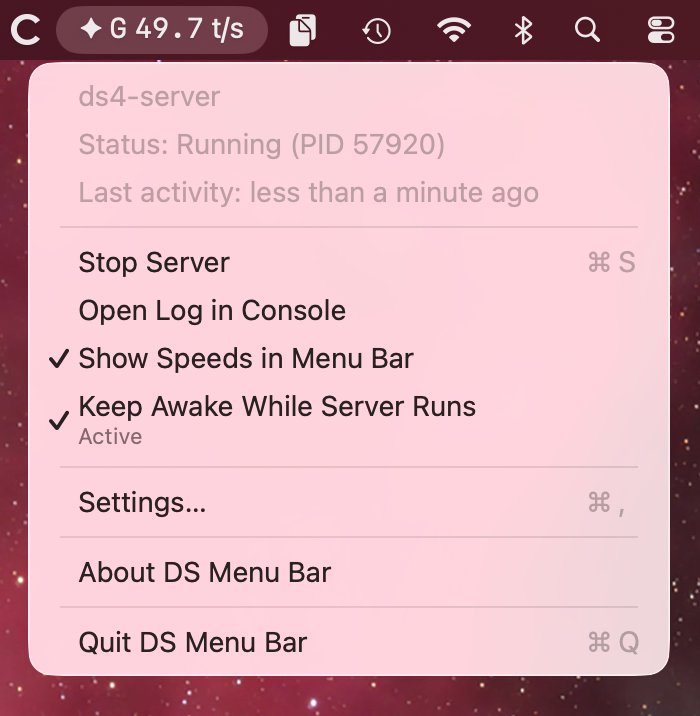
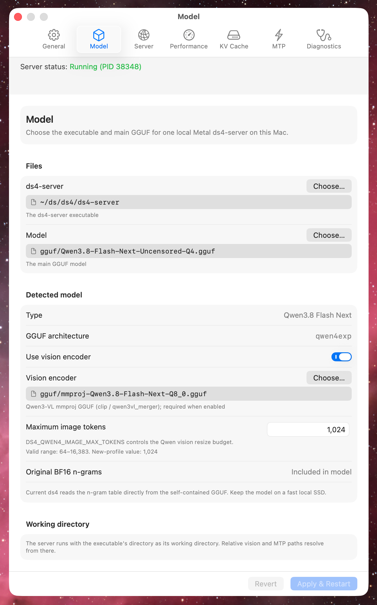

<p align="center">
  <picture>
    <source media="(prefers-color-scheme: dark)" srcset="docs/images/banner-white-text.png">
    <source media="(prefers-color-scheme: light)" srcset="docs/images/banner-black-text.png">
    
  </picture>
</p>

## Overview

DS Menu Bar is a native macOS control surface for your existing
[DwarfStar](https://github.com/antirez/ds4) setup. It starts, stops,
configures, and monitors one local `ds4-server` process without keeping a
terminal window open.

DS Menu Bar manages a single `ds4-server` process on your Mac where the app is
running. It does not manage remote, distributed, Linux, CUDA, or ROCm servers.
It does not download, build, bundle, or update `ds4-server` or model files.

<p align="center">
  
</p>

## Built for user-managed setups

DS Menu Bar works with your existing DwarfStar environment instead of creating
one of its own. This includes setups where you compile upstream commits, keep
multiple server builds, download selected model files yourself, or produce
your own compatible GGUFs.

- Choose the exact `ds4-server` executable and model files to run.
- Keep executables, models, logs, traces, and caches in locations you control.
- Inspect the complete generated command before applying a configuration.
- Change server builds or models without adopting an app-managed download or
  update workflow.
- Use the resulting local endpoint with any client that speaks one of the
  HTTP APIs `ds4-server` serves: OpenAI, Responses, Anthropic, or completion.

The app stores its configuration and manages only the server process it
launches. It does not copy, rename, replace, or delete the selected server or
model files.

## What it does

- Starts, stops, and monitors `ds4-server` from
  [DwarfStar](https://github.com/antirez/ds4).
- Shows the server state and process ID in the menu bar.
- Can show current prefill and generation throughput in a fixed-width menu-bar
  display.
- Provides model-aware settings for the server, model, performance, KV cache,
  MTP, and diagnostics.
- Detects supported DwarfStar GGUF model families and validates related files
  before starting the server.
- Captures server output in a rotating log that can be opened in Console.
- Can optionally record a request trace for diagnostics.
- Can keep the Mac awake while the server runs, when it is connected to a
  power adapter.
- Can launch automatically when you log in.

## Requirements

- macOS 26 or later
- An Apple silicon Mac
- A compatible `ds4-server` executable that you build or manage separately
  ([see the version compatibility note](#ds4-server-version-compatibility))
- A compatible DwarfStar-specific main GGUF that you download, create, or
  manage separately

Follow the [DwarfStar project](https://github.com/antirez/ds4) for server build
instructions and model-format information. DS Menu Bar does not include
`ds4-server` or model files.

### ds4-server version compatibility

> [!IMPORTANT]
> At the time of the DS Menu Bar v0.0.6 release, `ds4` does not publish
> versioned releases. Compatibility is therefore tracked against specific
> commits on its `main` branch, and DS Menu Bar is updated as upstream changes
> are reviewed. The latest known compatible commit is
> [`0aaea5a`](https://github.com/antirez/ds4/commit/0aaea5a238fb41a35106a551e73c8409dfb751ac)
> (September 20, 2026). Newer versions of `ds4-server` may also work, but
> compatibility is not guaranteed.

## Supported models

DS Menu Bar recognizes DwarfStar GGUFs for DeepSeek V4 Flash and single-file
DeepSeek V4 Pro, DeepSeek V4.1 Flash, Qwen3.8 Flash Next, GLM 5.2 (full),
GLM 5.3 (full), and GLM 5.3 Flash, along with their applicable DwarfStar
support files.

Distributed and split-model configurations, including the split DeepSeek V4
Pro pipeline, are not supported. DwarfStar-specific GGUFs are required;
arbitrary GGUF models are not supported.

## Install

Both methods install the same signed and notarized build. Homebrew is
recommended because it also handles updates.

### Homebrew (recommended)

```sh
brew install --cask jiiim/tap/ds-menu-bar
```

The cask requires an Apple silicon Mac running macOS 26 or later and refuses
to install elsewhere.

#### Updating

Refresh Homebrew's copy of the tap, then check whether a newer release exists:

```sh
brew update
brew outdated --cask ds-menu-bar
```

If the cask is listed as outdated, install the new version:

```sh
brew upgrade --cask ds-menu-bar
```

The upgrade quits DS Menu Bar if it is running, which stops the `ds4-server`
process it manages. Your settings, including the selected executable and model
paths, are stored outside the app bundle and survive the upgrade. Reopen
DS Menu Bar and start the server again when the upgrade finishes.

Review the [ds4-server version compatibility](#ds4-server-version-compatibility)
note after upgrading, in case the new release tracks a different upstream
commit than the `ds4-server` build you have.

### DMG

1. Download the DMG and its `.sha256` file from the
   [latest release](https://github.com/jiiim/ds-menu-bar/releases/latest).
2. Optional: verify the download from the directory containing both files, in
   Terminal:

   ```sh
   shasum -a 256 -c DS-Menu-Bar-vX.Y.Z-arm64.dmg.sha256
   ```

3. Open the DMG and drag **DS Menu Bar** onto the **Applications** shortcut.
4. Open **DS Menu Bar** from `/Applications`.

Updating a DMG installation means repeating these steps for each release.
Quit DS Menu Bar before replacing the app in `/Applications`.

Release DMGs are signed with Developer ID and notarized by Apple for normal
Gatekeeper validation.

## First run

The setup window connects DS Menu Bar to two files from your existing setup:

1. Your `ds4-server` executable.
2. The main GGUF model that the server should load.

The files remain in their existing locations and continue to be managed by
you. DS Menu Bar stores their paths in its configuration and uses them when
constructing the server command.

After setup, use the star icon in the menu bar to start or stop the server,
open its log, or open Settings. Applying settings while the server is running
restarts it with the updated configuration.

## Settings

Settings is organized into seven tabs. Available controls and defaults adapt
to the selected model and the Mac's unified memory.

- **General**: launch at login, the optional menu-bar throughput display,
  keeping the Mac awake while the server runs, a preview of the command that
  runs on Apply, and a restore of model tuning defaults.
- **Model**: the `ds4-server` executable and main GGUF model, detected model
  details, and vision encoder settings for models that support them.
- **Server**: the HTTP host and port, browser client access, the default
  output token limit, and resident session batching.
- **Performance**: context size, prefill chunk, GPU power limit, CPU helper
  threads, kernel selection, and SSD-backed model streaming for models that
  do not fit comfortably in available unified memory.
- **KV Cache**: optional disk checkpoints so later prompts and restarted
  sessions can reuse compatible prefixes, with a disk budget and checkpoint
  policies.
- **MTP**: optional speculative decoding through embedded or support-GGUF
  drafters, with draft depth, confidence, and sampling controls where the
  model supports them.
- **Diagnostics**: log location, size, and deletion; optional request
  tracing; and a simulated used-memory value for testing memory pressure.

Keep awake holds an idle-sleep assertion only while a server process is live
and the Mac is on a power adapter, so an unattended prefill or generation is
not cut short by the idle timer. The display still sleeps on its own
schedule, and closing the lid or sleeping from the Apple menu still sleeps
the Mac. The same switch is in the menu bar, where the check mark is the
preference and the subtitle below it reports whether the assertion is
currently held.

The Model tab for a detected Qwen3.8 Flash Next model:

<p align="center">
  
</p>

## Logs and request traces

Server output is written to `~/Library/Logs/dsmenubar/ds4.log` by default. The
log includes the launch command and server output and may therefore contain
local paths and diagnostic details. DS Menu Bar creates it with owner-only
permissions and keeps one rotated backup.

Request tracing is optional. A request trace can contain prompts, generated
output, cache decisions, and tool calls. Treat trace files as private data and
enable tracing only when needed. The Diagnostics tab keeps the selected trace
path when tracing is off and can delete an inactive trace.

## Build from source

Building requires macOS 26, an Apple silicon Mac, and the Xcode Command Line
Tools.

```sh
xcode-select --install
make test
make bundle
```

The app bundle is written to `.build/debug/DS Menu Bar.app`. To build a release
bundle and install it in `/Applications`:

```sh
make install
```

Source builds use an ad hoc signature and are intended for local development.

## Uninstall

Disable **Launch at login** in Settings and quit DS Menu Bar first, then
remove the app.

For a Homebrew installation:

```sh
brew uninstall --cask ds-menu-bar
```

Add `--zap` to also remove DS Menu Bar's preferences and its default log
directory:

```sh
brew uninstall --zap --cask ds-menu-bar
```

For a DMG installation, move `/Applications/DS Menu Bar.app` to the Trash.
Neither method touches your `ds4-server` executable or model files.

## Logo and App Icon

The logo for DS Menu Bar is a four pointed star, an homage to the name of the
DwarfStar project. Four points for the star were chosen in reference to the `4`
in `ds4-server` and the original `ds4.c` name of the DwarfStar project. For
the app icon, the four pointed star sits high on a purple background, like
a star in the evening sky. In the menu bar, when `ds4-server` is running, the
star is solid. When `ds4-server` is not running, the star is just an outline.
While `ds4-server` is starting, the star oscillates between solid and outline.

## License

DS Menu Bar source code and original bundled assets are available under the
[MIT License](LICENSE). Copyright James Martin and DS Menu Bar contributors.

DwarfStar, `ds4-server`, GGUF models, macOS, and Xcode are separate works
and are not licensed by this project. Refer to their respective terms and
licenses.
